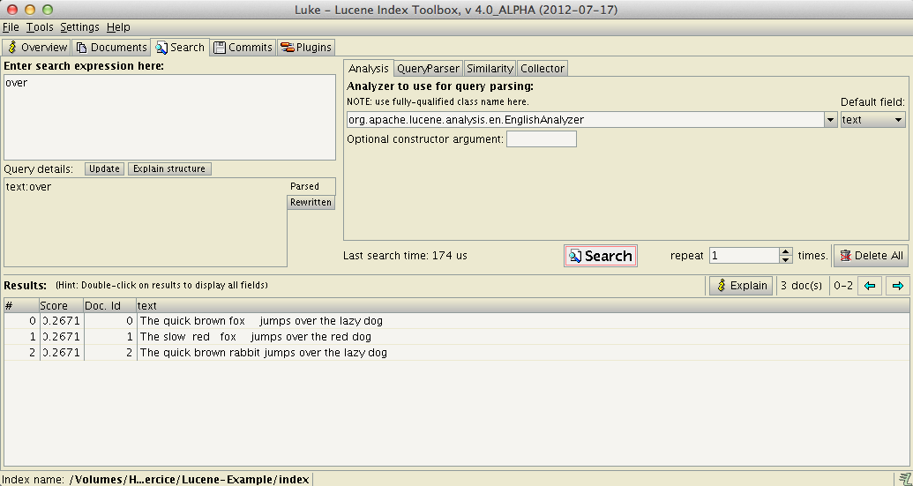

#Lucene Practicals

## 0. Download & Install

* Get code
** download and expand https://github.com/renaud/ir_tutorial_lucene/archive/master.zip
** or clone: `git clone https://github.com/renaud/ir_tutorial_lucene.git` (faster!)
* Launch Eclipse
* Menu `File` > `Import`, then `General`, `Existing Project into Workspace`
* `Select root directory` --> `Browse` to the folder `Lucene-Example` that you downloaded above
* Click on `Finish`

## 1. Getting started with Lucene

### 1.1. Index documents

`ch.epfl.coling.lucene.Indexer` demonstates how to index text. Run this class (right-click, then `Run as...` `Java Application`). See the output in the console.

See the comments in the code for further information.

Further reading:

* [Introduction to how Lucene scores documents](http://lucene.apache.org/core/4_0_0/core/org/apache/lucene/search/package-summary.html#package_description)
* [Description of Lucene's classic vector space implementation for ranking](http://lucene.apache.org/core/4_0_0/core/org/apache/lucene/search/similarities/TFIDFSimilarity.html)

### 1.2. Search documents

`ch.epfl.coling.lucene.Searcher` demonstates how to perform index search. You can launch it and test the *query parser* with the following queries:

* `jumps`
* `jum`
* `jum*` (wildcard search)
* `jumsp` 
* `jumsp~` (fuzzy searches based on Damerau-Levenshtein Distance)
* `red fox`
* `"red fox"` (phrase search)
* `fox NOT red` (boolean operators)

You can see that the retrieval of document is highly optimized:

1. The `searcher` first returns a `TopDocs` object (line 54), holding only a pointer to document ids;
1. On line 60, an actual `Document` is retrieved, and then its fields (here its content field) are retrieved ('unparsed').

Further reading:

* [Query parser syntax](http://lucene.apache.org/core/4_0_0/queryparser/org/apache/lucene/queryparser/classic/package-summary.html#package_description)

### 1.3 Inspect Index

[Luke](http://code.google.com/p/luke/) (can be found in folder `luke`, double click to launch) allows you to inspect the internals of a Lucene index. 

* Check the "Top ranking terms". What is missing? Why?

* Look at how a document is represented in the index: 
 1. Click tab `Documents`
 1. Browse to document # 1 (with blue arrow)
 1. Click on `Reconstruct & Edit`
 1. Click on tab `Tokenized (from all 'text' fields)`
 

 
* Search for documents
 1. Click on tab `Search`
 1. `Enter search expression:`: type `over`
 1. Select English Analyzer in dropdown
 1. Click `Search` button

## 2. Indexing a larger corpora

The `data` folder contains a corpus of 25k sentences from biomedical articles ([PMC](http://www.ncbi.nlm.nih.gov/pmc/)). To index it:

1. Delete the current index in the `index` folder
1. In `ch.epfl.coling.lucene.Indexer` line 43, call the function `getText2()` instead. 
1. Run the Indexer again
1. Check the index with Luke, try sample queries for 
 * `AMPA`, 
 * `GABA` (neurotransmitters)
 * `GABA receptor`, 
 * `"GABA receptor"` 

## 3. Using another Analyzer: adding your own stopwords

1. Uncomment code in `ch.epfl.coling.lucene.Indexer.getAnalyzer()` and modify the `stopwords` variable. 
1. Delete your index, and re-run the indexing.
1. Use Luke to find candidate words for the stoplist.

